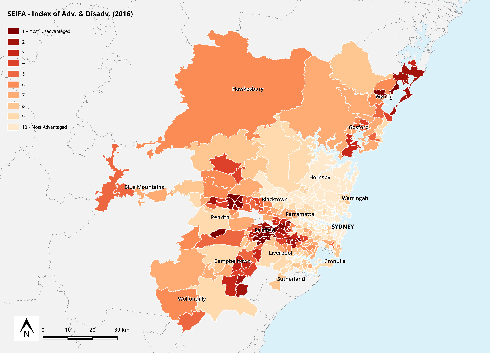
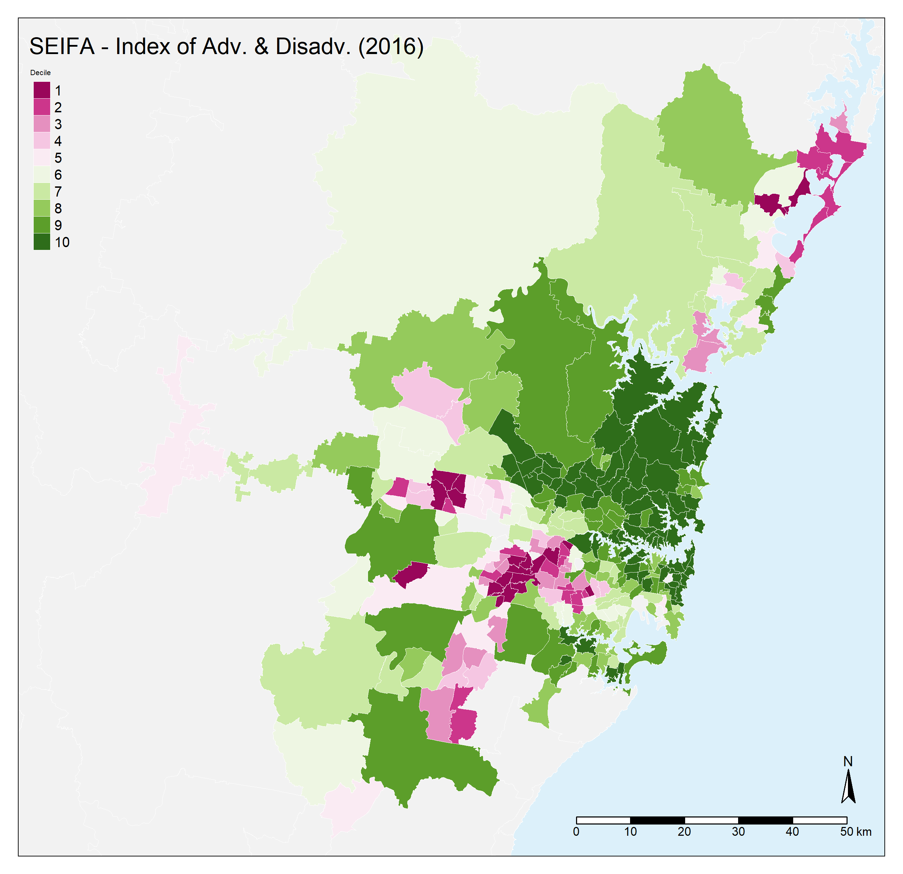

Below are two maps representing the Australian Bureau of Statistics’ (ABS) SEIFA data in the greater Sydney area. SEIFA stands for Socio-Economic Indexes for Areas and provides an indication of social advantage versus social disadvantage using data derived from the Census [@ABS2016a]. The maps present the SEIFA scores where a low score indicates that an area is relatively disadvantaged compared to an area with a higher score.

**A GUI-based map created in QGIS**

**A code-based map created in R and the tmap library**

**GUI vs Command based software** 
The boundary data to produce both maps was imported as a shapefile and joined to the SEIFA data from 2016 which was imported as a Comma Separated Values (CSV) file. The boundary data included the 'Statistical Area Level 2' (SA2) boundaries for all of Australia and therefore proved to be a very large dataset. SA2 areas are "medium-sized general purpose areas built up from whole Statistical Areas Level 1. Their purpose is to represent a community that interacts together socially and economically." [@ABS2016] Subsetting and joining this data took a few iterations in R however the same process was quite straight forward in QGIS. After a few unsuccessful iterations in R, subsetting the data in QGIS and re-importing into R became more feasible.  
 
QGIS had a much stronger visual component than R. Being able to immediately visualise the data in QGIS and see the effects of manipulations along with reversable operations like ‘Filter’, gave a much greater sense of control over the database. That being said, some manipulations in QGIS altered the original data which increased the risk of information loss. In R however, assigning data to variables permitted exploring the dataset without this risk.
  
The instantaneous visual feedback in QGIS also allowed playing with scale, colour palettes and text formatting much more intuitive when compared with R. Having to re-run large chunks of code in R to make visual changes because cumbersome. The plot previewer in R also did not provide an accurate representation of the scale and format which further hindered the usability of the software to create a visual and communicative map.
   
As a novice user, the need to memorise commands in R and entering them in the correct syntax hindered the ability to explore the full potential of the software. Even so, GUI software that are tailored to the inspection of data are said to have reduced functionality as they have lost more powerful operations at the expense of a user friendly interface [@Thrall1999]. The flexibility and power of having a complete programming language in R, with constructs such as variables, functions and the ability to loop through code became very apparent in the process of producing the maps above. 
  
**Cartographic good practice** 
Although both maps use the same dataset, the socio-economic divide in Sydney can be accentuated by just using a different colour palette in the map created in R when compared to the QGIS produced map.  This illustrates that colours and palette are an important part of making maps as the incorrect choice can confuse or mislead the viewer. The same data can also be perceived quite differently when applied at a different scale. For example, [this source]( https://readydemo.com.au/macroplan/maps/73731/SEIFA%20(2016%20vs%202011)#) applies the SEIFA Index of Advantage and Disadvantage (2016) to all of Australia and creates a very different picture of the same inequalities. The maps generated above therefore provide an incomplete view of reality by using selective information. As stated by Monmonier, this is the “paradox of cartography” – suppressing features to accentuate the critical information for spatial analysis [@Monmonier1996].
 

###Bibliography

